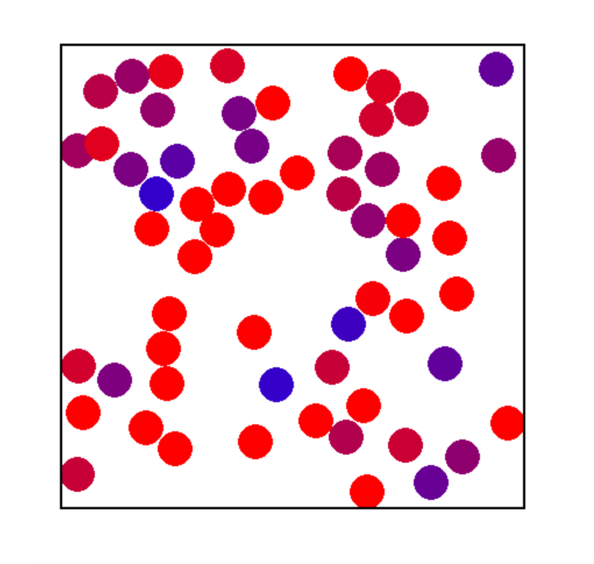
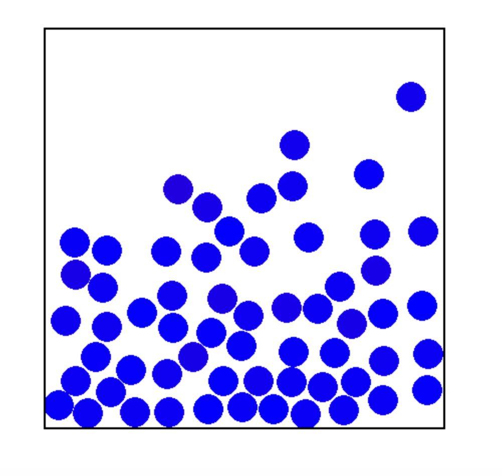

# Simple-Gas-Simulation

# Consider
- Thermodynamics
  - Boltzmann
- Kinetic Theory

###### (refer image : https://physics.stackexchange.com/questions/688607/why-does-the-shape-of-maxwell-boltzmann-distribution-depends-on-temperature-but)

  - Maxwell Boltzmann Distribution

# Result 

Credit frist version  (Pippone Francone | franconepippone) :  https://github.com/franconepippone/simple-gas-sim

# :star: Update now
-  ***[12/11/22]*** None
# :hankey: Bug and Problems
-  ***[12/11/22]*** It cannot show some pattern in object
